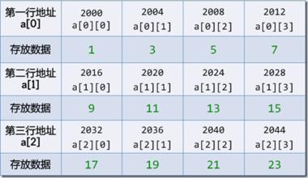

[home](../README.md)

## Solution1
主要考察二维数组的操作方式

二维数组在内存中的布局如下所示

int a[3][4]={{1,3,5,7},{9,11,13,15},{17,19,21,23}};则其在内存中的表示可能下面这样的



二维数组传递参数时的注意事项

- 使用二维数组名作为实参或者形参
注意必须注明第二维的类数
```C
void func(int array[][10]);
```

- 直接使用指针进行传递
```C
bool Solution1::find2(int * matrix, int rows, int columns, int number);
```


